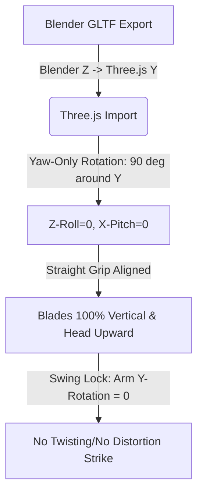
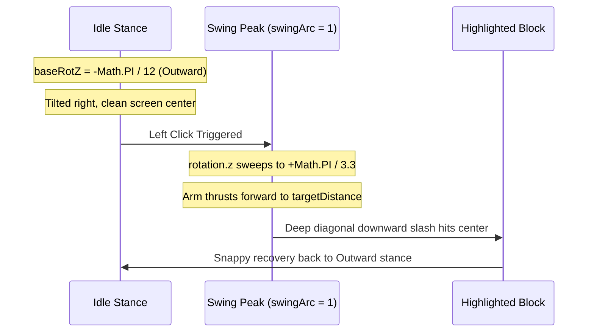

# 3D 곡괭이 정렬, 스윙 궤적 및 애니메이션 설계 원칙
> **Voxel Weapon & Pickaxe Alignment, Trajectory, and Animation Principles**

본 문서는 Three.js + TypeScript 기반의 복셀 그래픽 환경에서 1인칭 플레이어의 무기(특히 양날 곡괭이)를 손에 쥐는 정적 정렬 방식, 스윙 시의 물리적 궤적 계산법, 그리고 애니메이션 적용 과정에서 발생했던 다양한 실패와 이를 극복한 최종 수학적/기하학적 해결 원칙을 상세히 기록한 엔지니어링 가이드라인입니다.

---

## 1. 실패의 역사와 근본적인 기하학적 원인 분석
완벽한 궤적에 도달하기 전까지 겪었던 주요 실패 사례들과 그 이면에 숨겨진 3D 공간 기하학적 원인을 규명합니다.

### ❌ 실패 1: 부모-자식 회전 덮어쓰기 및 Euler Order 오작동
* **현상**: GLTF 모델에 아무리 미세 조정을 가해도 인게임에서 곡괭이를 바꾸는 순간(Equip) 정렬 상태가 초기화되거나 비틀어졌습니다.
* **원인**: 
  1. 기존 `equipTool` 메서드에서 무기를 손에 쥐어줄 때 자식 객체의 로컬 회전을 강제로 `(0, 0, 0)`으로 오버라이트하고 있었습니다.
  2. Euler 각도 회전 적용 시 순서 지정(`rotation.order`)이 설정되어 있지 않아 회전 축이 고정되지 않고 흔들리는 **임의의 짐벌 현상(Gimbal Drift)**이 나타났습니다.

### ❌ 실패 2: 곡괭이 머리의 처짐 및 하향 정렬 (Downward Stance)
* **현상**: 곡괭이 자루가 손목 축과 어긋나 기괴하게 꺾여 있으며, 곡괭이 머리가 위로 당당히 뻗지 못하고 땅을 향해 구부러진 상태가 되었습니다.
* **원인**: 
  - 곡괭이 양날을 화면상 수직(Vertical)으로 세우기 위해, 화면에 수직인 **Z축(Z-roll)**을 기준으로 약 `-90도` 회전(`-Math.PI / 2.2`)을 강제로 가했습니다.
  - 하지만 무기가 들어 있는 부모 팔 그룹(`rightArm`)이 이미 왼쪽(안쪽)으로 30도 기울어져 있는 특수한 공간이었습니다.
  - 이 공간에서 자식 객체인 곡괭이의 Z축을 직접 꺾어 버리니, 곡괭이 자루(Handle) 전체가 손목에 대각선으로 달라붙어 **오른쪽 아래 방향으로 약 90도 꺾인 형상**을 낳았고, 결국 곡괭이 머리가 땅을 처다보게 되었습니다.

### ❌ 실패 3: 타격(Swing) 순간의 일그러짐 및 모델 변형 현상
* **현상**: 정적 상태에서는 완벽하게 서 있던 곡괭이가 마우스로 타격을 개시하는 스윙 프레임 도중 사선으로 휘어지거나 찌그러져 다른 무기 모델처럼 보이는 현상이 일어났습니다.
* **원인**: 
  - 스윙 애니메이션 가속 궤적에 **팔 그룹의 Y축 회전(Yaw)**이 섞여 있었습니다:
    $$\text{rightArm.rotation.y} = -\text{swingArc} \times \frac{\pi}{4}$$
  - 무기 자루가 팔의 연장선인 Y축과 완벽하게 일치해 있었기 때문에, 팔 그룹의 Y축 회전은 **곡괭이 자루 자체를 중심축으로 회전시키는 팽이/나사 스핀**을 촉발했습니다.
  - 얇은 칼날 형태의 3D 메쉬가 고속으로 스핀을 돌다 보니 카메라 뷰에서는 넓적한 칼날 단면이 왜곡되어 투영되었고, 스윙 중간에 다른 모델로 교체되거나 기하학적으로 일그러진 것과 같은 시각적 착각을 유발했습니다.

---

## 2. 기하학적 해결 원칙 (The Solutions)
실패를 극복하고 도출한 3D 무기 정렬 및 렌더링에 관한 세 가지 핵심 수학적 해결 공식입니다.



### ① Yaw-Only Rotation 원칙 (Y축 단일 회전을 통한 수직성 획득)
곡괭이 자루를 손과 일직선으로 곧게 뻗게 하면서 양날만 수직으로 세우는 방법은 **오직 Y축(자루 자체의 코어 축)만을 90도 회전시키는 것**입니다.

* **수학적 전제**:
  - 모델의 자루가 Y축 방향을 향하고 머리 양날이 X축 방향으로 날개를 펼치고 있을 때:
  - X축(Pitch)과 Z축(Roll) 회전을 `0`으로 봉인하여 자루가 팔의 정방향과 한 치의 어긋남 없이 일치하도록 만듭니다.
  - 이 상태에서 Y축(Yaw)을 $\frac{\pi}{2}$ (90도) 회전시킵니다.
  - 결과적으로 자루는 완벽한 일직선을 유지한 채, X축 상에 넓게 퍼져 있던 날개가 **Z축(화면의 앞뒤 방향)으로 전환**되며 뷰포트 상에서 한 치의 오차도 없는 **100% 수직 칼날**을 자랑하게 됩니다.

```typescript
// D:\codedprograms\game\mine_craft_homage\minecaft_homage_ver10\src\CharacterModel.ts
clonedModel.rotation.order = 'ZYX';
clonedModel.rotation.set(0, Math.PI / 2, 0); // X-pitch=0, Z-roll=0 으로 곧게 뻗은 자루 실현
clonedModel.position.set(0.04, 0.05, -0.05); // 손목 관절에 안착시키는 프리미엄 Grip 위치 보정
```

### ② Spin-Lock Swing 원칙 (타격 시 종축 회전 완전 고정)
스윙이 진행되는 동안 무기 메쉬가 비틀리지 않고 정적 모습 그대로 뻗어 나가려면 **스윙 주기 속에서 무기의 로컬 진행 방향을 가로지르는 스핀 회전(Y축 회전)을 강제로 봉인(`0`)** 해야 합니다.

* **구현 방식**:
  - 팔 그룹이 위에서 아래로 종베기를 가할 때, `rotation.x`(종베기 각도)와 `rotation.z`(사선 각도)만 사용해 궤적을 제어하고, `rotation.y`는 상시 `0`으로 락을 겁니다.
  - 이를 통해 무기는 비틀림(Twisting) 없이 대기 중인 모습을 견고하게 유지한 채 순수하게 호를 그리며 나아갑니다.

---

## 3. 물리적 스윙 궤적 설계 이론 (The Physics of Trajectory)
최종적으로 성공을 가져다준 **오른손잡이 기준의 가장 현실적이고 이상적인 복셀 타격 궤적 모델**에 관한 물리 및 수학 공식입니다.



### ① Outward Idle $\rightarrow$ Inward Strike 궤적 이론
인게임 시야 확보와 실제 물리 법칙의 시너지 효과를 내기 위한 최적의 연동 궤적 기하학입니다.

#### 1. 대기 상태: Outward (바깥쪽 방향 대기)
화면 중심(Crosshair) 부근은 조준 및 환경 감지를 위해 비어 있어야 하므로, 대기할 때는 곡괭이를 우측 바깥 방향으로 비스듬히 들고 있어야 합니다.
$$baseRotZ = -\frac{\pi}{12} \quad (-15^\circ)$$

#### 2. 휘두르기 상태: Inward (안쪽 방향 사선 타격)
플레이어가 좌클릭을 눌러 타격이 가해지는 순간, 곡괭이는 바깥쪽(오른쪽)에서 시작해 **몸 안쪽(왼쪽 중앙)을 향해 쓸어 모으듯이** diagonal chop을 수행합니다.
$$\text{rightArm.rotation.z} = baseRotZ + \text{swingArc} \times \frac{\pi}{3.3}$$
* $swingArc = \sin(swingProgress \times \pi)$의 변화에 따라 Z축 각도가 대기 시 $-15^\circ$ 에서 타격 시 최대 $+39^\circ$ 까지 회전하며 중심 블록으로 쾌속 돌진합니다.
* 이는 오른손을 우측 뒤로 들었다가 가슴 중앙 앞 방향으로 대각선으로 힘껏 후려치는 인체공학적 타격 양식과 정확히 부합합니다.

---

### ② Dynamic Reach Extension (동적 도달 거리 보정 수학)
플레이어가 바라보고 있는 하이라이트된 타겟 블록까지의 기하학적 거리(DDA Raycast로 계산)를 실시간으로 탐지하여, 무기를 쥐고 있는 팔의 깊이(Z방향)를 동적으로 늘려주는 고급 물리 메카니즘입니다.

$$\text{zThrust} = \max\left(0.8, \text{targetDistance} - 0.15\right)$$
$$\text{rightArm.position.z} = -0.8 - \left(\text{swingArc} \times \text{zThrust}\right)$$

* **동작 원리**:
  - `targetDistance`: 플레이어 눈(카메라)에서 블록 타격점까지의 실제 거리 (기본값 `2.2`).
  - 마진 `0.15m`를 뺀 깊이만큼 팔 그룹의 로컬 Z좌표를 음수 방향(앞방향)으로 뻗어 줍니다.
  - 이로써 아주 멀리 떨어져 있는 블록을 때릴 때는 팔이 쭉 늘어나 중심 타점을 완벽하게 히트하고, 아주 가까운 블록이나 허공을 타격할 때도 관절이 엉뚱한 깊이에 가 있지 않도록 실시간 기하 정리가 완료됩니다.

---

## 4. 유니버셜 복셀 무기 배치 룰셋 (Voxel Tool Ruleset)
향후 칼, 도끼, 삽 등의 무기 및 도구를 추가할 때 본 프로젝트에서 공통적으로 준수해야 하는 만고불변의 절대 법칙입니다.

> [!IMPORTANT]
> **1. handle aligned straight**: 무기의 자루는 언제나 손목 중심점 및 팔의 방향과 일차(Straight) 상태여야 합니다. X/Z 로컬 오프셋은 무조건 `0`에 수렴시켜 일직선 그립을 만드십시오.
> 
> **2. 100% vertical crescent blade**: 칼날이나 도구의 넓은 머리는 플레이어가 보았을 때 화면에 평행하게 비틀어져 있으면 안 되고, 언제나 수직으로 반듯이 정렬되어 날렵함을 살려야 합니다. GLTF 모델은 Y축 기준 `Math.PI / 2` 회전으로 이를 만족합니다.
> 
> **3. Upward Idle posture**: 대기 상태에서는 머리가 당당히 위(Upward, 하늘)를 향하고 있어야 하며, 바깥쪽(`-Math.PI / 12`)으로 비스듬히 들려 시야를 방해하지 않아야 합니다.
> 
> **4. Spin-Locked animations**: 스윙 프레임 연산에서 팔 그룹에 어떠한 형태의 Yaw 회전(Y-spin)도 가하지 마십시오. 무기가 궤적 상에서 비틀리지 않고 본연의 날렵한 형태를 온전히 유지하며 타격하게 해야 합니다.
